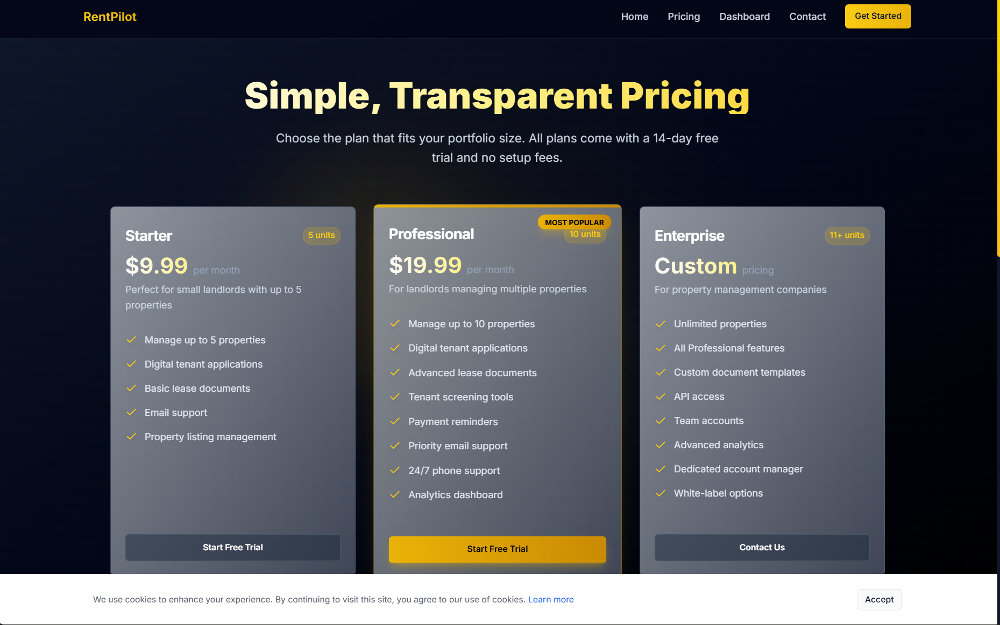

# RentPilot

RentPilot is a prototype SaaS project for **lease automation**. It demonstrates how landlords and property managers can streamline rental agreements by auto-filling lease templates and organizing tenant workflows.

---

## Features
- **Lease Auto-Filling** – Uses [PDF-Lib](https://pdf-lib.js.org/) to inject rental and tenant data into a lease template with 126+ AcroForm fields (text, checkboxes, signatures).
- **Sectioned Form UI** – Frontend form groups fields by lease sections, allowing users to complete agreements step by step.
- **Tenant & Rental Data Handling** – Inputs include tenant details, rental dates, payment terms, and signature fields.
- **Extendable Workflow** – Built to support future landlord–tenant processes (e.g., renewals, screening, e-signatures).

---

## Screenshots

### Login & Onboarding


### Landing Page


### Pricing Plans


### Privacy Policy


### Terms of Service


---

## Tech Stack
- **Frontend**: React + TailwindCSS  
- **Backend**: Node.js  
- **PDF Processing**: [PDF-Lib](https://pdf-lib.js.org/)
- **DateBase**: SQL
   
---

## Setup & Usage

### 1. Clone the repo

git clone (https://github.com/yasharisherenow/rentpilot-essentials-kit)
cd rentpilot-essentials-kit

### 2. Install dependencies

```bash
npm install
```

### 3. Run the development server

```bash
npm run dev
```

### 4. Fill out the form UI

* Navigate to `http://localhost:3000`
* Complete lease sections step by step.

### 5. Generate Lease PDF

* On submission, RentPilot injects the form data into the lease template.
* The filled lease PDF is output in `/output/lease.pdf`.

---

---

## Project Status

RentPilot is a **proof of concept** and is no longer actively developed.
It remains available as a portfolio project to demonstrate:

* PDF automation with Node.js
* Form-driven UI workflows
* SaaS-style product design

---

## Possible Next Steps

If extended, RentPilot could integrate with:

* **E-signature APIs** (DocuSign, HelloSign)
* **Tenant screening systems**
* **Cloud storage & sharing** for leases

---

## License

MIT License

```
